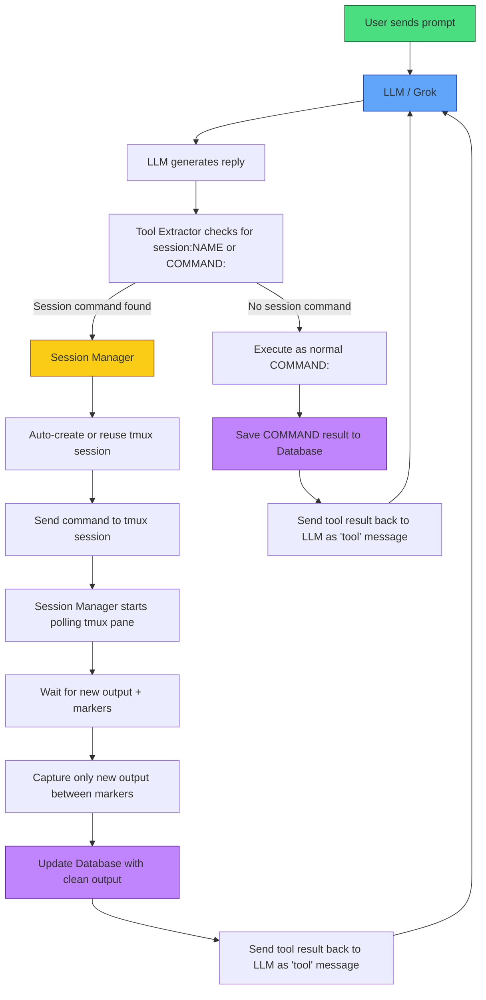

Feedback Welcome
This project is still evolving. If you clone it, try it, or have ideas on how to improve it, please leave feedback or suggestions. Even small thoughts help a lot.
Adapt – Grok Edition
This is the active development version of Adapt, a lightweight Rust-based agent framework designed specifically for Grok 4.3 (xAI API).
It evolved from the earlier Echo project and is now optimized for the Grok API while remaining flexible for local models.
Key Idea: Give Grok (or any strong model) clean, reliable tool use without heavy fine-tuning or complex templates.
Current Version: Rust v5 (Grok-optimized)
Why Grok + Adapt?

Extremely low cost (often just pennies per long session)
Strong reasoning and tool-use capabilities
Excellent personality that users actually enjoy
Fast response times compared to many local setups
Native support for raw text tool calling

Supported Features

Raw text tool calling (<command>your command here</command>) — Grok’s preferred method
Persistent sessions via tmux (<session name="NAME">)
JSON function calling support
Automatic context summarization
SQLite logging of all tool calls
Safety deny-list + command obfuscation
Persistent memory system (append_memory / read_memory)
ShareGPT-style JSONL training data generation

Current Status (June 2026)

Stable Grok API integration with reliable tool execution
Excellent multi-step command chaining
Clean output parsing and session management
Config-driven (endpoints, system prompts, safety rules)
Hybrid tool support (raw text + JSON)

Note: This branch is specifically tuned for Grok 4.3. The framework still supports local models, but the default prompts and behavior are optimized for the Grok API experience.

Quick Start (Grok API)

Get your xAI API key from console.x.ai

 1. Make sure your [llama.cpp](https://github.com/ggml-org/llama.cpp) servers are running
```bash
    - git clone https://github.com/ggml-org/llama.cpp
    - cd llama.cpp
    - cmake -B build
    - cmake --build build --config Release -j$(nproc)
```
    - Main model: port 8080
    - Summarizer (small model): port 8082
 2. Install dependencies
```bash
    - sudo apt install tmux
    - sudo apt install cargo
    - sudo apt install rustup
```
 3. Clone the repo
 ```bash
  git clone https://github.com/charlesericwilson-portfolio/Echo_Adapt_v5
  cd Echo_Adapt_v5
  git checkout Grok_Adapt_v5
```
 4. Edit the config file for your enpoints and system prompts starting system prompts are in echo_rust_agent_proxy/main_system.txt and echo_rust_agent_proxy/summarizer.txt
  
 5. **Build or run Rust version**
```bash
  cd [build directory]
  cargo build --release
  ./target/release/echo_rust_wrapper
  ```
OR Test first
```bash
  cd [build directory]
  cargo run
  ```
 6. Enjoy yourself and please provide feedback.
 
Developed with AI assistance from Grok(XAI)
