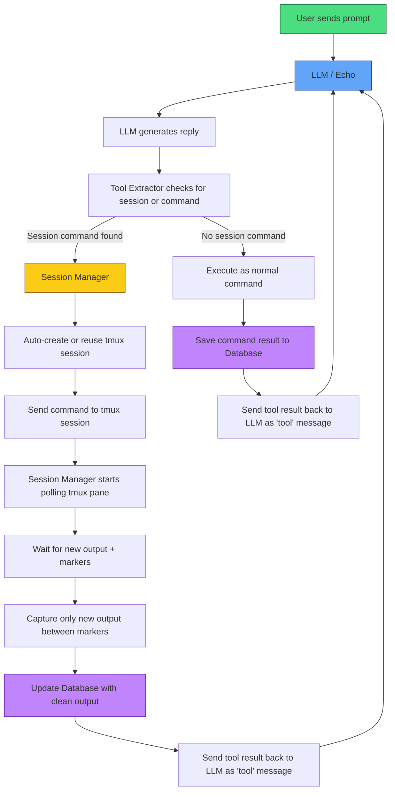

## Feedback Welcome
This project is still evolving. If you clone it, try it, or have ideas on how to improve it, **please** leave feedback or suggestions. Even small thoughts help a lot. If you want to start at the beginning click [here](https://github.com/charlesericwilson-portfolio/Echo_Project_Overview) or for the model training [here](https://github.com/charlesericwilson-portfolio/Echo_training_project)

## **If you want to use it with Grok API check out the Grok Adapt branch and working on combining it all in the future.**

# Adapt Tool Proxy System
This is the active development version of the Echo agent project — a lightweight, local LLM agent tool system written in Rust. I use a [Qwen 2.5 Coder 14B Instruct](https://huggingface.co/Qwen/Qwen2.5-Coder-14B-Instruct) that has been trained using [QLoRA](https://github.com/charlesericwilson-portfolio/Echo_training_project) as a merged base.
It is a continuation of the earlier [Echo Adapt_v3](https://github.com/charlesericwilson-portfolio/Echo_Adapt_v3) and adds support for proxy-style tool calls, opt in opt out output summarization, and database logging.
Key idea: If your model can already tell you what commands to type and doesn't use a jinja template, it can use tools through this framework. No special fine-tuning is required.

The raw text methods are ready to use out of the box.
JSON tool support is also available, we have a reliable web search using duck duck go and we have a browse page function that reads the pages found in the search results. The way for the model to use them has been added to the sample system prompt included in the repo.
A basic system prompt is included to teach the model the tool format, but you can replace it with your own.

Current version: Rust v5 (previous Python proxy version was v4)
The goal of this project is to keep the framework flexible so that the model’s capabilities are the main limitation — not artificial restrictions in the code.

### Quick Start

## Supported Back-ends

Echo works with **any server or API that speaks the OpenAI Chat Completions format**. You are **not** locked into llama.cpp.

### Local Servers (Recommended)
| Backend            | Notes                              | Recommendation      |
|--------------------|------------------------------------|---------------------|
| **llama.cpp**      | Use `--api` flag                   | Best overall        |
| **vLLM**           | High performance                   | Great for speed     |
| **Ollama**         | Built-in OpenAI compatibility      | Easiest to start    |
| **LM Studio**      | Has built-in OpenAI server         | Very beginner friendly |
| **TabbyAPI**       | Excellent with exllama/exllamav2   | Strong choice       |
| **Aphrodite**      | Good performance                   | Solid alternative   |
| **SGLang**         | Modern inference engine            | Good performance    |

### Cloud APIs
- **OpenAI**
- **Groq**
- **Together.ai**
- **Fireworks.ai**
- **DeepInfra**
- **OpenRouter**
- **Mistral** (OpenAI compatible mode)
- Most other OpenAI-compatible providers

> **Note:** Anthropic, Google Gemini, and raw Hugging Face endpoints are **not** supported at this time. In the process of adding a selector to pick between protocols.


 1. Make sure your [llama.cpp](https://github.com/ggml-org/llama.cpp) servers are running
```bash
    - git clone https://github.com/ggml-org/llama.cpp
    - cd llama.cpp
    - cmake -B build
    - cmake --build build --config Release -j$(nproc)
```
    - Main model: port 8080
    - Summarizer (small model): port 8082
 2. Install dependencies
```bash
    - sudo apt install tmux
    - sudo apt install cargo
    - sudo apt install rustup
```
 3. Clone the repo
 ```bash
  git clone https://github.com/charlesericwilson-portfolio/Echo_Adapt_v5/tree/main
  cd Echo_Adapt_v5/echo_rust_agent_proxy
```
 4. Edit the config file for your enpoints and system prompts starting system prompts are in echo_rust_agent_proxy/main_system.txt and echo_rust_agent_proxy/summarizer.txt
  
 5. **Build or run Rust version**
```bash
  cd [build directory]
  cargo build --release
  ./target/release/echo_rust_wrapper
  ```
OR Test first
```bash
  cd [build directory]
  cargo run
  ```
 6. Enjoy yourself and please provide feedback.
 7. If you want more restricted environment I have included a bash script to set up a restricted user with restricted access for write only to a workspace directory. You can adjust the permissions as you see fit just make it executable with
```bash
chmod +x setup-restricted-model-user.sh
sudo ./setup-restricted-model-user.sh
```
Then in the terminal run 
```
su - model-user
```
then either cargo run or execute the executable
 
## Current Status (June 2026)

- **Stable**: `<command></command>` raw text tool execution
- **Functional**: Persistent `<session name = NAME></session>` tool execution via tmux with smart output capture and tool output cleaning
- **Stable** multi-line command and file writing support with xml tags <command>command here</command>. You can change the flag name in the code before compile right now but will eventually be going into config.toml
- **JSON function calling** is functional I have included a web search tool and a browse page tool to read the results and you can define your own tools according to your needs.
- **Semantic search cross thread memory** memory functions append_memory to save memories and embeddings and read_memory to do a semantic search only pulling relevant data into context.
- Refactored to use config.toml to set endpoints and set your system prompts in text files for the main model and the summarizer model without recompiling.
- Context auto-summarization 
- SQLite database logging for all tool calls and summaries
- Config driven opt in opt out for tool summaries.
- Safety deny-list for dangerous commands as well as obsfication and at the token level. You can add anything you want to block in the config.toml.
- ShareGPT-style JSONL logging for training data

The agent can fluidly switch between raw text commands, persistent tmux sessions, and structured JSON tool calls depending on what the model decides to use or you can simply instruct the model to use one or more of your choosing. 

## Memory System
Echo now has persistent cross-thread memory stored in memory.md.
Features:
Semantic retrieval — Pulls relevant past context using embeddings and cosine similarity
Selective append — Only important facts, preferences, and events are saved
Human readable — Easy to open and review the memory file
Configurable — Memory file path set in config.toml

Available Tools:

append_memory(category, content) — Save new information
read_memory(query, limit) — Retrieve relevant context

The agent will automatically use memory when relevant and append new important details.
This makes Echo much better at long-term recall and consistency across sessions.

## Features

- **Hybrid Tool Calling**: Supports both simple command syntax and modern JSON function calling
- **Persistent Sessions**: Full tmux integration with named sessions and clean output capture
- **Flexible Architecture**: Designed so users can add their own tools easily
- **Local-First**: Works with local models (llama.cpp, Ollama, etc.)
- **Extensible**: Includes full TOML config support for endpoints, system prompts, safety deny list, and tool definitions

## Roadmap

- TOML config file for endpoints, system prompt, and allowed tools, still adding features to the TOML.
- Cleaner terminal UI
- Better multi-model support (easy switching between local and cloud models)
  
### What it does
- Supports **hybrid raw-text tool calling** and Json:
  - `<command> command here </command>` for simple one-shot shell commands
  - `<session name = NAME> command here </session>` for persistent tmux sessions (ideal for msfconsole, long-running shells, etc.)
  - `<json> <Open AI tool format> </json>`
  - `<end_session name = NAME/>`
- Automatic tmux session creation/reuse
- Marker- time based clean output capture (only returns new command output, not full session history)
- Safety deny list (blocks dangerous commands before execution)
- JSONL logging in ShareGPT format (already capturing training examples of when/why to use SESSION vs COMMAND)
- Fast blocking HTTP client talking to your local llama.cpp servers
- Sqlite database support for tool logging.
- Auto summarization of context at 50K tokens.
- Interrupt generation using ctl+\ end session using ctl+c.

### Special considerations
I changed the tokenizer chat template on my local model to accept user, assistant, system, and tool message types.
The Problem with Standard Tool Result Handling
Most OpenAI-compatible chat templates only define three message roles: system, user, and assistant. When an agent framework needs to return tool output back to the model, the only available slot is user — so tool results get injected as if the human typed them.
This creates a fundamental semantic mismatch. The model was trained to treat user messages as new instructions requiring a response. So when it sees tool output injected as a user message, it reasons: a user gave me new information, I should act on it — and calls another tool. Which produces more output. Which gets injected as another user message. Which triggers another tool call. The loop never resolves because nothing in the token stream signals "this task is complete."
The Solution
By extending the tokenizer config to recognize a native tool role as a first-class message type, the model receives tool output in a semantically distinct slot it was trained to understand as feedback from its own actions, not as a new request from a user. It knows the wrapper executed the command on its behalf. It knows the output is the result of something it initiated. And it knows when the task is done because the feedback confirms completion rather than prompting further action.
