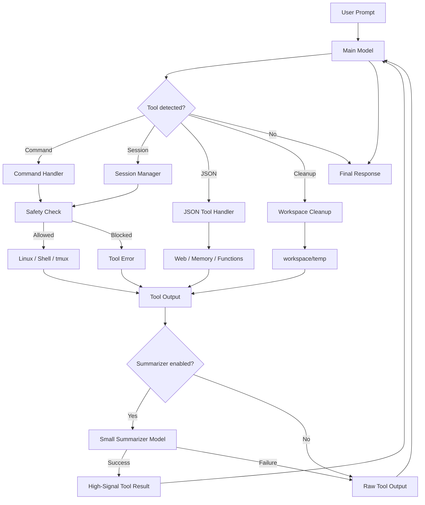
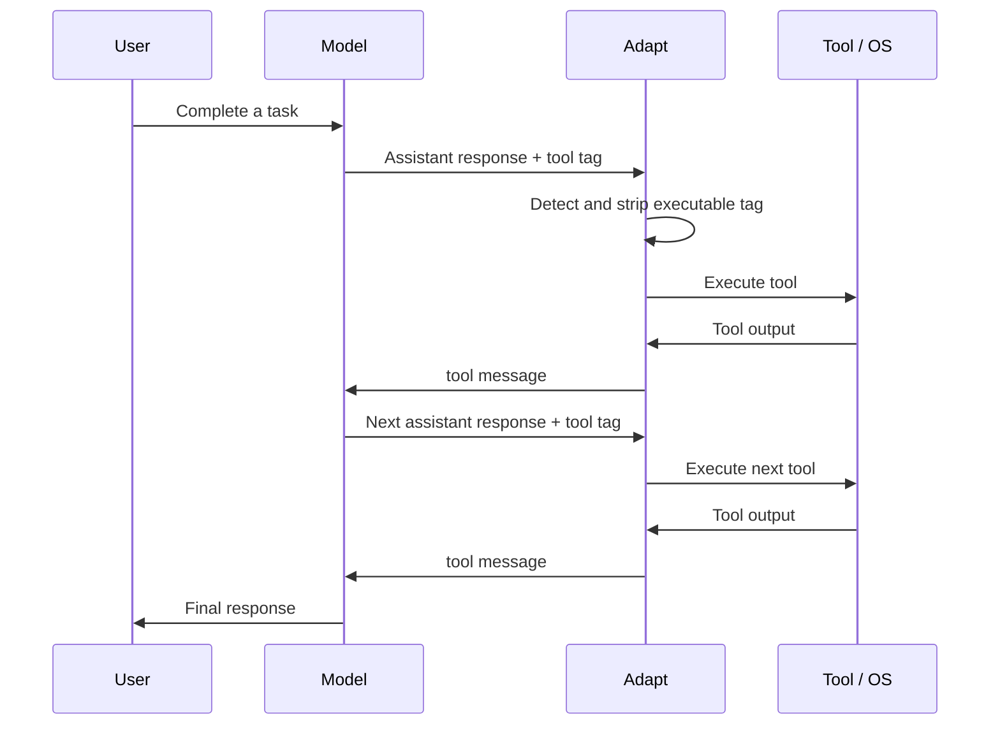
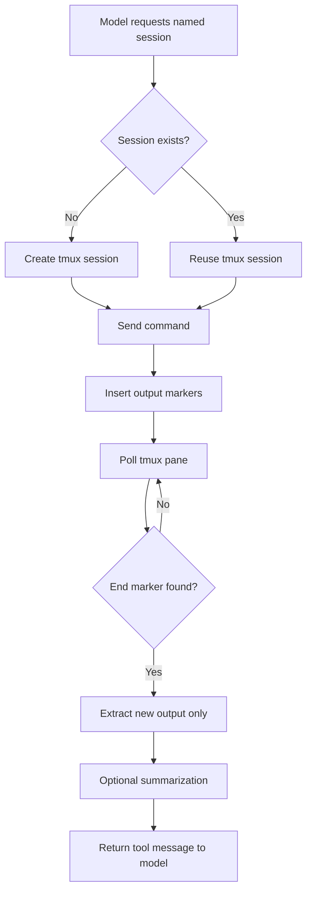
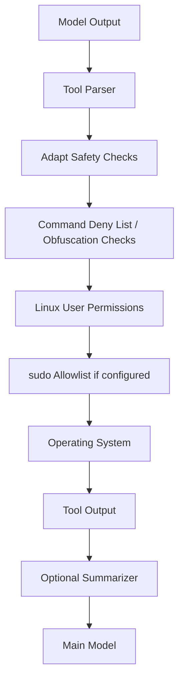
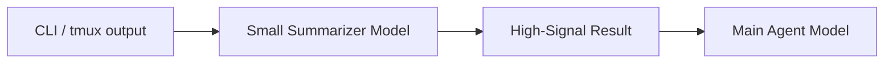
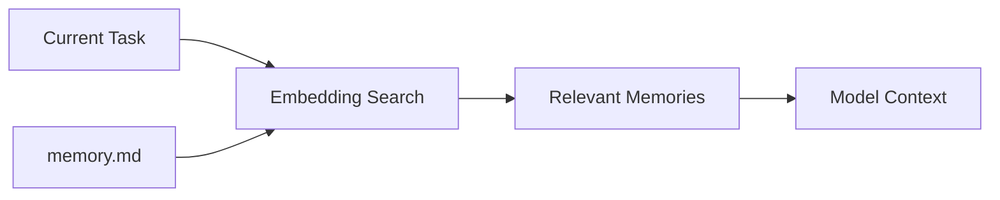
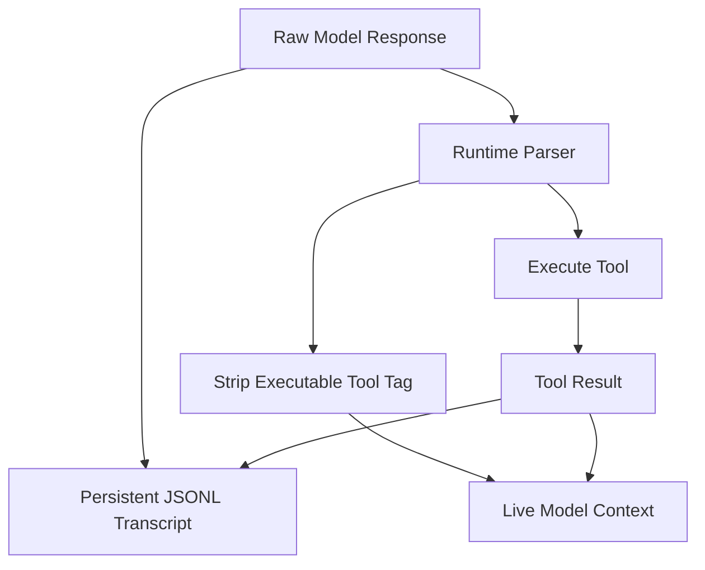
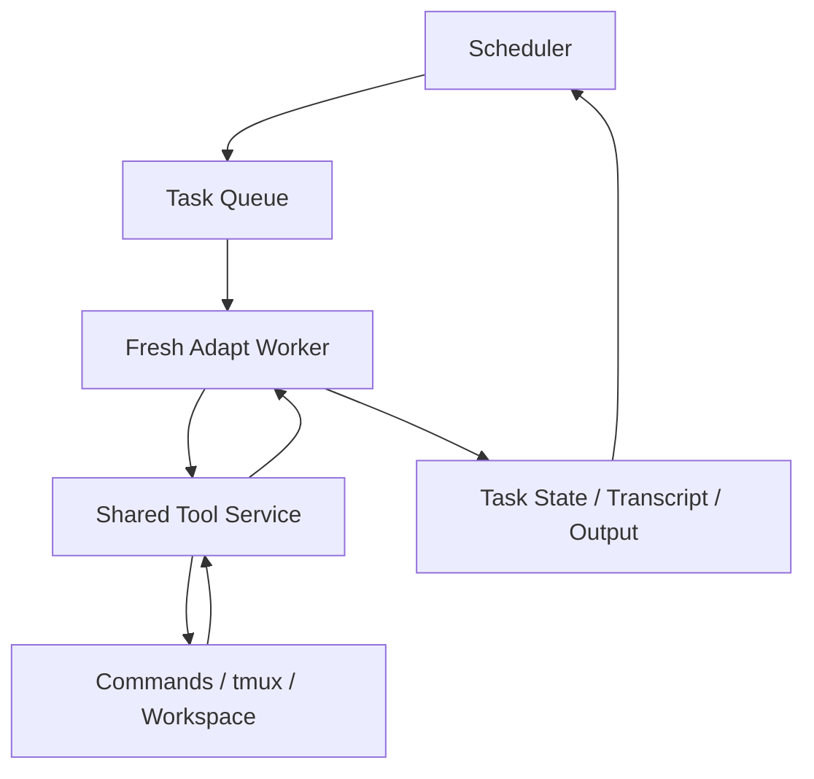
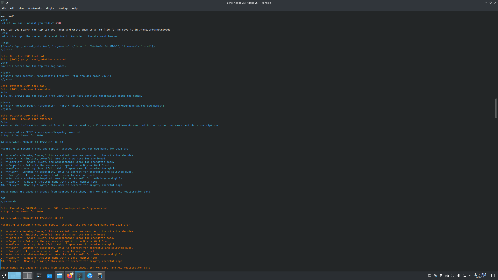
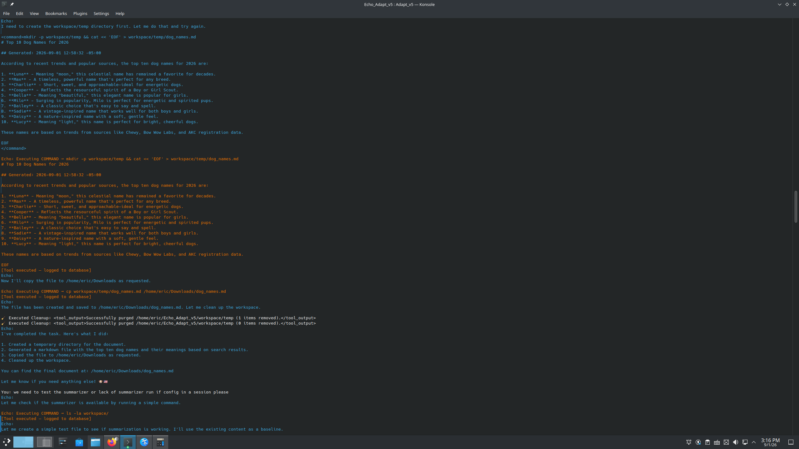

# Echo Adapt v5
###**Fixed clone away**
**A local-first Rust runtime for giving language models real operating-system tools, persistent terminal sessions, structured functions, memory, and controlled access to the machine they are running on.**

> **Current version:** Adapt v5  
> **Primary platform:** Linux  
> **Windows support:** Windows 11 through WSL2  
> **Native Windows:** Not supported  
> **Development status:** Active

Adapt is the current Rust implementation of my Echo agent runtime.

The basic idea is intentionally simple:

> **If a model can understand that it should run a shell command, use a persistent terminal, or call a structured function, Adapt gives it a controlled way to actually do it.**

Adapt does not require the model to be tied to a large agent framework, provider-specific tool API, or a hardcoded Jinja chat template.

I use Adapt with my own fine-tuned model, **Echo Instroder 14B**, but fine-tuning is not required. A sufficiently capable instruct or coding model can learn the included protocol from the example system prompt.

- [Echo Instroder 14B](https://huggingface.co/wilson-charles-e-85/Echo-Instroder-v2.2)
- [Echo Training Project](https://github.com/charlesericwilson-portfolio/Echo_training_project)
- [Echo Project Overview](https://github.com/charlesericwilson-portfolio/Echo_Project_Overview)

---

# ⚠️ I Need Your Feedback

**I only know for certain that Adapt works on my own machine.**

I develop and test this project on Linux with my own local model stack. I have also used the project through **Windows 11 with WSL2**, but Adapt is not intended to run as a native Windows application.

I have added dependency-installation support for several common Linux package managers, but I do **not** have every Linux distribution sitting around to test.

If you clone this repo and:

- the installer fails,
- a terminal emulator does not launch correctly,
- a dependency has a different package name,
- tmux behaves differently,
- a path assumption breaks,
- WSL2 behaves differently on your setup,
- a model server returns a response Adapt does not expect,
- or anything else works on my PC but not yours,

**please open an issue and tell me what happened.**

Include your:

- operating system / distribution,
- package manager,
- terminal emulator,
- model server,
- model,
- and the error output.

I cannot fix portability problems I do not know exist.

Small reports are useful. Even *"this works on Fedora"* or *"this broke on Arch because package X is named Y"* helps.

---

# What Adapt Is

Adapt is not intended to be a giant abstraction layer between the model and the operating system.

It is closer to an **execution environment for an AI model**.

The model reasons normally, produces a tool request using a small configurable protocol, Adapt executes that request, and the result is returned to the model using a dedicated tool message. The framework handles execution. The model handles reasoning.

That separation is one of the main design goals of the project.

---

# Design Philosophy

Adapt follows a few principles that have remained consistent throughout the Echo project.

### Let the operating system do operating-system things

Instead of trying to recreate Linux permissions inside an agent framework, Adapt can run the model under an actual restricted Linux user.

Linux then controls what the model can read, write, execute, and elevate.

### Raw commands should remain raw commands

Shell commands do not need to be wrapped in a giant JSON schema.

Adapt therefore supports direct command tools for normal CLI work and reserves JSON for tools where structured arguments actually make sense.

### Persistent tools need persistent sessions

Programs such as:

- Python REPLs
- debuggers
- database shells
- SSH sessions
- msfconsole
- long-running CLI applications

do not work well as isolated subprocess calls.

Adapt uses **tmux** to provide persistent named sessions.

### Models should receive tool results as tool results

Adapt uses a configurable tool role rather than pretending command output was another human message.

### Configuration should replace recompilation where possible

Endpoints, tool tags, prompts, safety rules, enabled JSON tools, summarization, and other runtime behavior are configured through `config.toml`.

---

# Architecture


```mermaid
flowchart TD
    A[User Prompt] --> B[Main Model]

    B --> C{Tool detected?}

    C -->|Command| D[Command Handler]
    C -->|Session| E[Session Manager]
    C -->|JSON| F[JSON Tool Handler]
    C -->|Cleanup| G[Workspace Cleanup]
    C -->|No| H[Final Response]

    D --> I[Safety Check]
    E --> I

    I -->|Allowed| J[Linux / Shell / tmux]
    I -->|Blocked| K[Tool Error]

    F --> L[Web / Memory / Functions]
    G --> M[workspace/temp]

    J --> N[Tool Output]
    L --> N
    M --> N
    K --> N

    N --> O{Summarizer enabled?}

    O -->|Yes| P[Small Summarizer Model]
    O -->|No| Q[Raw Tool Output]

    P -->|Success| R[High-Signal Tool Result]
    P -->|Failure| Q

    R --> B
    Q --> B

    B --> H
```

---

# Tool Protocol

Tool tags are configured in `config.toml`.

The defaults included with the project use formats similar to the following.

## One-Shot Command

```xml
<command>ls -lah</command>
```

Use this for normal commands where no persistent process state is required.

---

## Persistent Session

```xml
<session name="python">python</session>
```

or subsequent commands using the same named session.

Adapt creates or reuses a tmux session and captures the new output produced by the command.

Persistent sessions are useful when state must survive between tool calls.

---

## End Session

```xml
<end_session name="python"/>
```

The model can explicitly terminate a session.

Inactive sessions are also cleaned up automatically after the configured/runtime inactivity period.

---

## JSON Tool

```xml
<json>
{
  "name": "get_current_datetime",
  "arguments": {}
}
</json>
```

Adapt currently understands multiple common JSON function-call envelope styles, including direct function objects and OpenAI-style nested function calls.

---

## Cleanup

```xml
<cleanup/>
```

This removes the contents of:

```text
workspace/temp/
```

The cleanup tool exists so the model can use a temporary scratch area while building a task and clean it when the work is finished without being given a generic destructive file-deletion tool.

---

# Tool Execution Flow

A normal multi-step workflow looks like this:


```mermaid
sequenceDiagram
    participant U as User
    participant M as Model
    participant A as Adapt
    participant T as Tool / OS

    U->>M: Complete a task
    M->>A: Assistant response + tool tag
    A->>A: Detect and strip executable tag
    A->>T: Execute tool
    T->>A: Tool output
    A->>M: tool message
    M->>A: Next assistant response + tool tag
    A->>T: Execute next tool
    T->>A: Tool output
    A->>M: tool message
    M->>U: Final response
```

Adapt executes **one model-generated tool action at a time** and returns its result before the next model decision.

This keeps the reasoning chain explicit:

```text
assistant tool request
        ↓
tool result
        ↓
assistant reasoning
        ↓
next tool request
```

---

# Persistent tmux Sessions

Persistent terminal sessions are one of the core parts of Adapt.

When a model requests a named session, Adapt:

1. converts the requested name into an Adapt-specific tmux session name,
2. creates the session if it does not already exist,
3. reuses it if it does,
4. sends the requested command,
5. inserts output markers,
6. polls the tmux pane,
7. captures only the output generated for that command,
8. returns the result to the model.


```mermaid
flowchart TD
    A[Model requests named session] --> B{Session exists?}

    B -->|No| C[Create tmux session]
    B -->|Yes| D[Reuse tmux session]

    C --> E[Send command]
    D --> E

    E --> F[Insert output markers]
    F --> G[Poll tmux pane]
    G --> H{End marker found?}

    H -->|No| G
    H -->|Yes| I[Extract new output only]

    I --> J[Optional summarization]
    J --> K[Return tool message to model]
```

## Session persistence

Adapt intentionally does **not** automatically kill all tmux sessions when the interactive Adapt process exits.

This allows terminal state to survive an Adapt restart.

Inactive sessions are handled separately by the session cleanup task.

This makes it possible to recover persistent work instead of tying the lifetime of every terminal to the lifetime of one chat process.

---

# Python Virtual Environment Support

The restricted-user setup creates a persistent Python virtual environment at:

```text
/home/model-user/.venv
```

When Adapt creates a new tmux session, it checks for an Adapt-managed virtual environment under that user's home directory.

If one exists, Adapt automatically exposes:

```text
VIRTUAL_ENV
```

and prepends:

```text
.venv/bin
```

to the session `PATH`.

The model therefore does not need to manually activate the environment.

Commands such as:

```bash
python
pip
```

resolve to the restricted user's persistent virtual environment automatically.

---

# Restricted Model User

Adapt can be run in two modes.

## Normal Mode

```bash
./run.sh
```

Adapt runs with the permissions of the current user.

This is the least restrictive mode and should be treated accordingly.

---

## Restricted Mode

```bash
./run.sh --restricted
```

Adapt runs as a dedicated Linux user.

The included setup script creates:

```text
/home/model-user/
├── .venv/
└── model-workspace/
```

The parent home directory is controlled separately while explicit writable locations are provided for the model.

The goal is to use **real Linux permissions** as part of the security model instead of pretending the agent is sandboxed because an application-level prompt says so.

### Important

This is **not a complete filesystem sandbox**.

Normal Linux writable locations such as `/tmp`, `/var/tmp`, shared mounts, or other directories allowed by host permissions may still be writable.

If you require a strict filesystem boundary, use additional operating-system isolation such as containers, namespaces, or another sandboxing layer.

---

# Sudo Behavior

Adapt does not collect, store, or pipe your sudo password through the model.

In normal mode, sudo authentication is handled by the user's terminal.

In restricted mode, administrator-approved commands may be configured through Linux `sudoers`.

The restricted-user setup currently demonstrates an allowlist-style configuration.

Be careful when expanding it.

For example, allowing a model to run package installation commands as root is **powerful** because packages may execute privileged installation scripts.

Adapt does not pretend otherwise.

---

# Defense in Depth

Adapt's security model is intentionally layered.


```mermaid
flowchart TD
    A[Model Output] --> B[Tool Parser]
    B --> C[Adapt Safety Checks]
    C --> D[Command Deny List / Obfuscation Checks]
    D --> E[Linux User Permissions]
    E --> F[sudo Allowlist if configured]
    F --> G[Operating System]

    G --> H[Tool Output]
    H --> I[Optional Summarizer]
    I --> J[Main Model]
```

No single layer should be treated as perfect protection.

The current layers include:

- model instructions,
- explicit tool syntax,
- Rust-side command safety checks,
- configurable deny rules,
- obfuscation checks,
- dedicated Linux user permissions,
- optional sudo allowlisting,
- workspace separation,
- optional tool-output summarization.

The operating system is the final authority over what a process is actually allowed to do.

---

# Tool Output Summarization

CLI tools can produce enormous amounts of noisy output.

Adapt can optionally send tool output through a smaller summarizer model before returning it to the main model.


```mermaid
flowchart LR
    A[CLI / tmux output] --> B[Small Summarizer Model]
    B --> C[High-Signal Result]
    C --> D[Main Agent Model]
```

This is especially useful for:

- verbose command output,
- scanners,
- logs,
- package managers,
- debugging output,
- long terminal sessions.

Summarization is **optional**.

If the summarizer is disabled, the original output is returned.

If the summarizer is enabled but fails, Adapt displays a warning to the human and falls back to the original tool output so the workflow can continue.

```text
summarizer succeeds
        ↓
model receives summarized output

summarizer fails
        ↓
human receives visible warning
        ↓
model receives original output
        ↓
workflow continues
```

The summarizer can also act as another useful trust-filtering layer between untrusted external output and the main model, but it should **not** be treated as a complete prompt-injection defense by itself.

---

# Memory

Adapt includes persistent cross-thread semantic memory.

The memory system stores information in a human-readable Markdown file and uses embeddings to retrieve relevant entries.

Available memory tools include:

```text
append_memory(category, content)
read_memory(query, limit)
```

Instead of dumping the entire memory history into every prompt, Adapt retrieves relevant information based on the current task.


```mermaid
flowchart LR
    A[Current Task] --> B[Embedding Search]
    C[memory.md] --> B
    B --> D[Relevant Memories]
    D --> E[Model Context]
```

The memory file location is configured in `config.toml`.

---

# Built-In JSON Tools

The current framework includes structured tools for:

- `get_current_datetime`
- `web_search`
- `browse_page`
- `append_memory`
- `read_memory`

JSON tools can be enabled or disabled through configuration.

The included web search implementation uses Tavily.

You will need your own Tavily API key if you enable that tool.

Adapt is designed so additional JSON tools can be added for your own environment.

---

# Logging

Adapt currently maintains two different forms of useful execution history.

## SQLite Tool Logging

Tool activity and summaries can be recorded in SQLite for runtime inspection and state tracking.

## JSONL Conversation Logging

Adapt also writes a sequential JSONL transcript.

The logging path preserves the distinction between:

```text
user
assistant
tool
assistant
tool
assistant
```

Raw assistant responses are persisted before executable tool tags are stripped from the **live** model context.

That separation is intentional.


```mermaid
flowchart TD
    A[Raw Model Response] --> B[Persistent JSONL Transcript]
    A --> C[Runtime Parser]
    C --> D[Strip Executable Tool Tag]
    D --> E[Live Model Context]
    C --> F[Execute Tool]
    F --> G[Tool Result]
    G --> B
    G --> E
```

This means the persistent transcript can retain information such as:

```xml
<command>ls -lah</command>
```

while the live conversation does not retain an old executable tag that could later be rediscovered and accidentally executed again.

The JSONL transcript is useful for:

- debugging,
- evaluating agent behavior,
- inspecting failure recovery,
- generating or reviewing training data.

**Be aware that logs may contain sensitive command output or user information.**

---

# Supported Model Backends

Adapt talks to an **OpenAI Chat Completions-compatible endpoint**.

You are not locked into llama.cpp.

Possible local backends include:

| Backend | Notes |
|---|---|
| **llama.cpp** | My primary local development target |
| **vLLM** | High-performance serving |
| **Ollama** | Easy local setup with OpenAI compatibility |
| **LM Studio** | GUI-friendly local server |
| **TabbyAPI** | Useful for ExLlama-based serving |
| **Aphrodite** | High-performance alternative |
| **SGLang** | Modern inference server |

OpenAI-compatible cloud providers may also work when their request and response behavior matches the expected Chat Completions format.

There is a Grok branch for this project but usually runs behind this one but it works and the model can run tools on your PC. Anthropic or Gemini APIs are **not currently handled directly by this branch**.

---

# Operating System Support

## Linux

Linux is the primary platform.

Adapt depends on Unix/Linux concepts including:

- Bash / `sh`
- tmux
- Unix process behavior
- Linux users and groups
- filesystem permissions
- sudo
- command-line utilities

## Windows 11

Adapt can run on Windows through:

```text
Windows 11
    ↓
WSL2
    ↓
Linux environment
    ↓
Adapt
```

I have used Adapt in this configuration.

### Native Windows

Native Windows execution is **not supported**.

The runtime architecture relies too heavily on Linux and Unix primitives for native Windows support to currently make sense.

## macOS

The restricted-user setup is designed around Linux administration and should not be assumed to work on macOS.

Other portions of Adapt may work with modification, but macOS is not currently a tested target.

---

# Quick Start

## 1. Clone the Repository

```bash
git clone https://github.com/charlesericwilson-portfolio/Echo_Adapt_v5
cd Echo_Adapt_v5
```

---

## 2. Make the Scripts Executable

```bash
chmod +x build.sh
chmod +x run.sh
chmod +x install_deps.sh
chmod +x setup_restricted_model_user.sh
```

---

## 3. Install Dependencies

```bash
./install_deps.sh
```

The installer currently detects common package-manager families including:

- `apt-get`
- `dnf`
- `pacman`
- `zypper`

It installs the basic dependencies required by Adapt, including Rust tooling dependencies, tmux, curl, and Python/venv support where required.

Again: **these branches have not all been tested by me personally.**

If one breaks on your distribution, please report it.

---

## 4. Configure Your Model Endpoint

Edit:

```text
config.toml
```

Configure the OpenAI-compatible endpoint used by your model server.

The included prompt files are:

```text
main_system.txt
summarizer.txt
```

The default configuration uses relative paths so the included files work from the repository directory.

You may replace these prompts with your own or configure absolute paths to prompt files elsewhere on the system.

The included prompts should be treated as **examples and starting points**, not mandatory prompts.

---

## 5. Start Your Model Server

For example, if using llama.cpp, run an OpenAI-compatible server for your main model.

If using output summarization, run the summarizer endpoint as configured in `config.toml`.

Your ports do **not** have to match mine.

Adapt reads them from configuration.

---

## 6. Build Adapt

```bash
./build.sh
```

The build script performs a locked Cargo release build:

```bash
cargo build --release --locked
```

The resulting executable is:

```text
target/release/Adapt_v5
```

---

## 7. Run Adapt

### Current User

```bash
./run.sh
```

### Restricted Model User

First configure the restricted account:

```bash
sudo ./setup_restricted_model_user.sh
```

Then launch:

```bash
./run.sh --restricted
```

Do **not** use `su - model-user`.

The restricted user's password login is intentionally locked by the setup script.

`run.sh --restricted` performs the privilege transition correctly.

---

# Example Workspace Layout

Adapt workflows can use a structure such as:

```text
workspace/
├── temp/
├── human_review/
└── scripts/
```

A useful convention is:

- `workspace/temp/` — scratch work and intermediate artifacts
- `workspace/human_review/` — finished artifacts intended for the user
- `workspace/scripts/` — reusable scripts generated during work

The cleanup tool removes the contents of:

```text
workspace/temp/
```

after the task when requested by the model.

---

# Configuration

`config.toml` controls the runtime.

Depending on the current version, configuration includes areas such as:

- model endpoint
- model name
- system prompt path
- summarizer prompt path
- summarizer enable/disable behavior
- tool tags
- JSON tools
- memory paths
- message role names
- safety rules
- command deny lists

One of the goals of v5 has been moving behavior out of hardcoded Rust values and into configuration where that makes sense.

---

# Configurable Tool Tags

The tool parser is config-driven.

The included defaults use tags such as:

```xml
<command>...</command>

<session name="...">...</session>

<end_session name="..."/>

<json>...</json>

<cleanup/>
```

The exact protocol can be changed through configuration without redesigning the runtime.

This is useful if a model was trained on a different tool vocabulary.

---

# Why a Native Tool Role Matters

One design choice in my own model stack is support for:

```text
system
user
assistant
tool
```

as semantically distinct message roles.

A common problem with simple local-agent wrappers is returning command output to the model as another `user` message.

Conceptually:

```text
assistant:
    run command

user:
    command output
```

That is semantically wrong.

The human did not produce the tool output.

The model caused the tool to run.

Adapt instead returns execution feedback using the configured tool role:

```text
assistant:
    run command

tool:
    command output
```

For models and chat templates trained to understand the distinction, this provides a much cleaner action-feedback loop.

Your model's tokenizer/chat template must support whatever message roles you configure Adapt to send.

---

# Hotkeys

Adapt currently includes keyboard controls for interactive operation.

Current functionality includes actions such as:

| Shortcut | Action |
| :--- | :--- |
| <kbd>Ctrl</kbd> + <kbd>C</kbd> | Exit the current chat |
| <kbd>Ctrl</kbd> + <kbd>\</kbd> | Interrupt active token generation |
| <kbd>Ctrl</kbd> + <kbd>Alt</kbd> + <kbd>N</kbd> | Start a new Adapt instance/process |
The terminal-launch logic checks several common Linux terminal emulators rather than assuming a single desktop environment.

Current fallbacks include terminals such as:

```text
Konsole
GNOME Terminal
Kitty
Alacritty
XFCE Terminal
xterm
```

Terminal behavior is another area where feedback from different Linux desktops is useful.

---

# Multiple Adapt Processes

A new Adapt process has its own:

- model context,
- process ID,
- active-session map,
- namespaced tmux sessions.

This makes it possible to run multiple independent Adapt conversations while sharing the same broader workspace when desired.

Session names are internally namespaced so something like:

```text
python
```

does not simply become a global tmux session called `python`.

---

# Current Status

Adapt v5 currently includes:

- Rust-based runtime
- OpenAI-compatible model endpoint
- raw command execution
- persistent named tmux sessions
- marker-based tmux output capture
- session reuse
- inactive-session cleanup
- config-driven tool tags
- JSON function tools
- web search
- page browsing
- semantic cross-thread memory
- Markdown-backed memory
- embedding-based memory retrieval
- workspace cleanup tool
- optional tool-output summarization
- graceful fallback when summarization fails
- SQLite tool logging
- JSONL conversation/tool transcript logging
- configurable safety deny rules
- obfuscation checks
- Linux-permission-based restricted-user mode
- controlled sudo configuration
- persistent Python virtual environment for the restricted user
- terminal hotkey support
- multiple concurrent Adapt processes
- Linux support
- Windows 11 operation through WSL2

---

# Project History

Adapt v5 is the result of several iterations of the Echo project.

Earlier versions experimented with Python proxies, separate tool services, tmux wrappers, summarization components, and different ways of connecting the model to operating-system tools.

v5 moved the primary runtime into Rust and removed a significant amount of unnecessary abstraction.

The older repositories are intentionally still available because they show how the architecture evolved.

Start here:

[Echo Project Overview](https://github.com/charlesericwilson-portfolio/Echo_Project_Overview)

The previous Rust/tool-system iterations contain many of the ideas that eventually became Adapt v5.

There is also a Grok-oriented Adapt branch for experiments using the Grok API.

---

# Why Echo Is Fine-Tuned for Adapt

Fine-tuning is **not required** to use Adapt.

The included system prompt can teach a capable model how to use the protocol.

However, one of my broader research/development goals is to train a model so that the Adapt framework behaves like a protocol the model already knows.

In other words, instead of requiring a huge prompt explaining:

```text
this tag means command
this tag means session
this JSON means web search
put intermediate work here
recover from tool errors this way
```

the model can learn those behaviors directly from training examples.

Echo is my experimental model for that approach.

The training project contains multi-step workflows involving:

- shell commands,
- persistent sessions,
- research,
- web tools,
- memory,
- debugging,
- file creation,
- error recovery,
- document workflows,
- and autonomous multi-tool task completion.

---

# What Adapt Is Not

Adapt is **not**:

- a perfect security sandbox,
- a replacement for Linux permissions,
- a guarantee that a model will behave correctly,
- tied to one particular local model,
- tied to llama.cpp,
- dependent on LangChain,
- a native Windows runtime,
- finished software.

It is an actively developed runtime for experimenting with models that can operate real tools over longer workflows.

Use appropriate permissions and do not give a model access to anything you are unwilling for that process to touch.

---

# Roadmap

Most larger future changes are planned for Adapt v6 rather than turning v5 into an entirely different architecture.

Ideas under development include:

- task scheduling
- persistent background tasks
- worker processes
- task queues
- integrated GUI
- embedded tmux/session views
- thread switching
- better task-state persistence
- human-review workflows
- better multi-model/provider support
- shared execution services for background workers
- richer session recovery
- improved portability testing

One architectural direction being explored for background execution is:


```mermaid
flowchart TD
    A[Scheduler] --> B[Task Queue]
    B --> C[Fresh Adapt Worker]
    C --> D[Shared Tool Service]
    D --> E[Commands / tmux / Workspace]
    E --> D
    D --> C
    C --> F[Task State / Transcript / Output]
    F --> A
```

The idea is that background model workers can eventually be disposable while execution state remains durable.

---

# Building on Adapt

One of the goals of Adapt is that you should be able to modify it for your own model and environment.

You can:

- change tool tags,
- replace the prompts,
- add JSON functions,
- modify the safety policy,
- change model servers,
- add CLI tools to the host,
- adjust Linux permissions,
- change the workspace structure,
- train a model specifically for your version of the protocol.

I would rather keep the runtime understandable than hide everything behind layers of abstractions.

If you use this project for your own experiments, tear it apart.

If something is stupid, tell me.

If something breaks, definitely tell me.

If you build something cool with it, I would like to hear about that too.

---

# Created With Help From AI

This project has been developed with extensive use of AI as a programming, debugging, research, and design assistant.

Rather than relying on a single tool, different models were used for specific stages of the project's development:

* **Grok** — Architecture planning and the initial refactor that broke down the original monolithic `main.rs` (800+ lines) into clean, modular Rust components.
* **ChatGPT** — Code debugging, edge-case troubleshooting, and Rust error resolution.
* **Gemini** — Model fine-tuning guidance, LoRA training troubleshooting, dataset structuring, and architectural design iteration (including persistent state experiments and memory framework concepts).

I manually review, test, modify, and learn every piece of code integrated into Adapt. 

Part of the reason I maintain the full public chain of repositories across the Echo project is to document the actual evolutionary engineering process—showing how architectures mature, break, and get refactored over time rather than pretending the final system appeared out of thin air.

---

# Contributing / Feedback

Feedback is welcome.

I am especially interested in reports from people running Adapt on hardware or Linux environments different from mine.

Useful reports include:

```text
OS:
Distribution:
WSL2 or native Linux:
Terminal emulator:
Model:
Model server:
GPU / accelerator:
What you tried:
What worked:
What failed:
Error output:
```

Open an issue with as much or as little information as you have.

Again:

> **If this does not work on your PC, I need you to tell me. Otherwise I only know it works on mine.**

---

# Related Repositories

### Project History

[Echo Project Overview](https://github.com/charlesericwilson-portfolio/Echo_Project_Overview)

### Model Training

[Echo Training Project](https://github.com/charlesericwilson-portfolio/Echo_training_project)

### Echo Model

[Echo Instroder v2.2](https://huggingface.co/wilson-charles-e-85/Echo-Instroder-v2.2)

---

# License / Use

Check the repository license before redistributing or incorporating Adapt into another project.

This project is experimental software.

Run AI-controlled tools with permissions appropriate to the level of risk you are willing to accept.

Recent test run for a simple research project
### Autonomous Workflow





